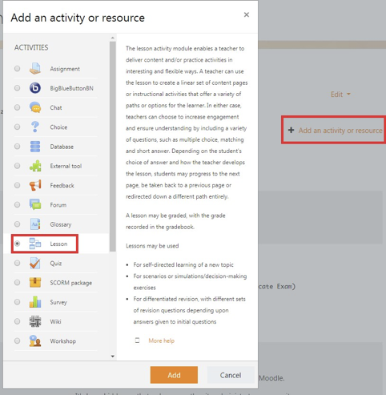
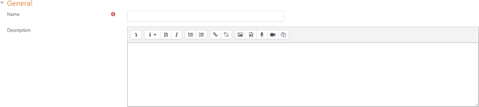
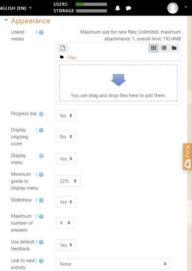
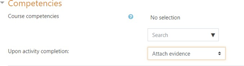

COME CREARE UNA LEZIONE
====
Benvenuto, in questa sezione potrai capire come creare una lezione:
====

TUTORIAL PER LA CREAZIONE DI UNA LESSONS SU MOODLE

        Benvenuti nel tutorial per la creazione di una lesson su moodle.

        Che cos'è Moodle?

        \ |STYLE0|\  è un ambiente informatico per la gestione di corsi, ispirato al costruzionismo, teoria secondo la quale ogni apprendimento sarebbe facilitato dalla produzione di oggetti tangibili.

        Innanzitutto prima di poter creare una lessons in moodle bisonga effettuare l'accesso come Teacher (professore), in modo da poter creare ed modificare una lessons.

        Qui dovrete inserire il vostro username ed password per eseguire l'accesso, se non si è registrati prima di accedere bisogna registrarsi.

        Dopo aver eseguito l'accesso come Teacher si potrà creare una lezione.

         Passaggi per la creazione di una lessons: Passo 1:

        Innanzitutto per creare una lessons bisogna abilitare le modifiche, per farlo fare click sull'ingranaggio in altro a destra della schermata ed selezionare l'opzione \ |STYLE1|\ 

Passo 2:

        Dopo aver abilitato l'editing bisogna andare ad selezionare

         \ |STYLE2|\  dopo aver cliccato ci apparirà una finestra con varie opzioni quella che si dovrà scegliere sarà \ |STYLE3|\ (lezione).

\ |IMG1|\ 

        Dopo aver selezionato \ |STYLE4|\  premere su \ |STYLE5|\  per crearla.

Passo 3:

        Dopo aver selezionato \ |STYLE6|\  apparirà una nuova schermata divisa in due parti, nella prima parte ossia quella in alto bisognerà inserire il titolo della nostra lezione, subito sotto se si vuole si può inserire una breve descrizione della lezione quest'ultima può essere fatta visualizzata o meno.

\ |IMG2|\ 

 

        Passo 4:

        Nella stessa schermata, nella seconda parte ossia quella inferiore ci vengono proposte varie opzioni relative alla lezione:

* Appearance

* Availability

* Flow control

* Grade

* Common module sttings

* Restrict access

* Tags

* Competencies

Appearance:

        Questa opzione ci consente di inserire all'interno della nostre lezioni alcune strumenti:

    * Si posso inserire dei file che sono presenti nel nostro computer, come immagini, video o GIF.

    * Barra di progressione del percorso, e in che modo deve progredire.

    * U piccolo menu che verrà posto a fine pagine il quale fa visualizzare quante pagine sono presenti nella lezione, mostrandone il titolo inoltre si può dare la grandezza al menu.

    * Grazie all'ultimo strumento si può inserire un link a fine lezione per

             far si che l'utente possa andarci direttamente senza tornare alla schermata home.

\ |IMG3|\ 

Availability:

        Questa opzione ci consente di:

* Inserire una data per l'apertura della lezione ed una data per la chiusura.

* Inserire un timer per l'esecuzione

* Inserire una password per entrare nella lezione

* Far si che la lezione sia accessibile anche da offline attraverso l'app per i cellulari.

Flow control:

        Questa opzione ci permette di:

* Fare la review allo studente se all'interno della lezione ci fossero dei quiz.

* Permettere allo studente di ripetere la lezione

* Decidere quante volte lo studente può ripetere la lezione

* Decidere che azione fare dopo una risposta corretta

* Quante pagine si vuole far vedere.

 

 

Grade:

        Questa opzione ci permette di:

* Assegnare un voto allo studente.

* Decidere una soglia per la sufficienza.

* Decidere se lo studente può esercitarsi attraverso la lezione.

* Decidere quanto vale il punteggio per ogni risposta.

* Decidere se lo studente può ripetere in caso fosse andato male.

* Tener conto dei tentativi fatti precedentemente, questa funziona solo se l'opzione precedente è attiva.

* Decidere quante domande fare.

 

        Common module settings:

        Questa opzione ci consente di:

* Nascondere o far vedere la lezione agli studenti.

* Associare un ID alla lezione.

* Group mode ha tre funzioni:

#. \ |STYLE7|\ , ossia che non esiste un gruppo.

#. \ |STYLE8|\ , ossia che i gruppi esistenti possono soltanto lavorare nel proprio gruppo e non possono vedere gli altri.

#. \ |STYLE9|\ , ossia che lavorano per il proprio gruppo, ma possono vedere anceh gli altri.

* \ |STYLE10|\  è una \ |STYLE11|\ ollezione di gruppi con dei corsi, questri gruppi possono essere assegnati agli studenti iscritti.

 

        Restrict access:

        Questa opzione ci permette di:

    * Applicare delle restrizioni di vario tipo:

#. \ |STYLE12|\ , ossia che impedisce l'accesso alla lezione fino a una determinata data.

#. \ |STYLE13|\ , richiede agli studenti di raggiungere un grado specificato per entrare nella lezione.

#. \ |STYLE14|\ , controlla l'accesso in base ai campi all'interno del profilo dello studente.

#. \ |STYLE15|\  set, permette di aggiungere una serie di restrizioni nidificate.

 

        Tags:

        Questa opzione ci consente di:

    * Creare dei tag che possono riferirsi alla parte più importante della lezione.

 

        Competencies:

        Questa opzione ci consente di:

    * Decidere quali sono le competenze che gli studenti devono avere

    * Decidere a fine lezione se:

#. \ |STYLE16|\ 

#. \ |STYLE17|\ 

#. \ |STYLE18|\ 

#. \ |STYLE19|\ 

\ |IMG4|\ 

 

        Passo 5:

        Dopo aver settato le opzioni desiderete, fare click su save and display per inizare subito ad aggiungere pagine alla lessons creata.

         Ecco la schermata della aggiunta della pagina:

        Ci sono 2 tipi di pagine da poter selezionare e creare:

#. \ |STYLE20|\ 

#. \ |STYLE21|\ 

        Mentre \ |STYLE22|\  ed \ |STYLE23|\  sono delle funzioni a parte:

#. \ |STYLE24|\ : serve per importare domande in una varietà di formati.

#. \ |STYLE25|\ : serve per aggiungere un pulsante in fondo alla lezione, quest'ultimo può portarti in diverse lezione oppure nella pagina successiva oppure nella pagina precedente ecc.. dipende dall'impostazione che gli si da. Comunque si consiglia di crearli all'interno della creazione di una \ |STYLE26|\  o di una \ |STYLE27|\  in modo di organissarsi meglio.

        Add a content page:

        Questo tipo di foglio ci permette di digitare del testo a nostro piacimento, inoltre è possibile allegare dei link di altri siti, caricare immagini e dimensionarle, creare tabelle ecc…, quindi funzioni simili a quelle che ci vengono date da Word e da LibreOffice.

        La visualizzazione della schermata è molto simile a quella della creazione della lesson, quindi:

    * Bisogna per forza inserire un titolo alla lezione

    * Inserire un testo o immagine o tabelle ecc…

    * Si deve per forza inserire almeno un pulsante, quest'ultimo può portarci alla pagina successiva(se esiste), alla pagina precedente, alla pagina stessa, oppure alla fine della lezione.

        Add a question page:

        A differezna della content page, questa pagina permette di inserire all'interno della lezione dei quiz intermedi offrendo diversi tipi di strutture,ossia:

#. \ |STYLE28|\ : 4 risposte 1 corretta inoltre è possibile impostare che ci siano più risposte corrette.

#. \ |STYLE29|\ : Risposta aperta, breve

#. \ |STYLE30|\ 

#. \ |STYLE31|\ : simile alla Multichoice ma la risposta corretta è solo una

#. \ |STYLE32|\ : sono presenti due colonne formate da caselle. L'obbiettivo è formare delle coppie con le caselle delle due colonne.

#. \ |STYLE33|\ : Data una domanda, lo studente deve sviluppare una risposta aperta argomentando

.. bottom of content

.. |STYLE0| replace:: **Moodle**

.. |STYLE1| replace:: **Turn Editing on.**

.. |STYLE2| replace:: **+Add an activity or resource,**

.. |STYLE3| replace:: **Lessons**

.. |STYLE4| replace:: **lessons**

.. |STYLE5| replace:: **Add**

.. |STYLE6| replace:: **Add**

.. |STYLE7| replace:: **No group**

.. |STYLE8| replace:: **Separete group**

.. |STYLE9| replace:: **Visible group**

.. |STYLE10| replace:: **Grouping**

.. |STYLE11| replace:: **c**

.. |STYLE12| replace:: **Date**

.. |STYLE13| replace:: **Grade**

.. |STYLE14| replace:: **User profile**

.. |STYLE15| replace:: **Restriction**

.. |STYLE16| replace:: **Fare nulla**

.. |STYLE17| replace:: **Allegare la prova**

.. |STYLE18| replace:: **Inviarla per la revisione**

.. |STYLE19| replace:: **Completare la competenza.**

.. |STYLE20| replace:: **Add a content page**

.. |STYLE21| replace:: **Add a question page**

.. |STYLE22| replace:: **Import questions**

.. |STYLE23| replace:: **Add a cluster**

.. |STYLE24| replace:: **Import question**

.. |STYLE25| replace:: **Add a cluster**

.. |STYLE26| replace:: **Add a content page**

.. |STYLE27| replace:: **Add a question page**

.. |STYLE28| replace:: **Multichoice**

.. |STYLE29| replace:: **Short Answer**

.. |STYLE30| replace:: **True or False**

.. |STYLE31| replace:: **Numerical**

.. |STYLE32| replace:: **Matching**

.. |STYLE33| replace:: **Essay**

