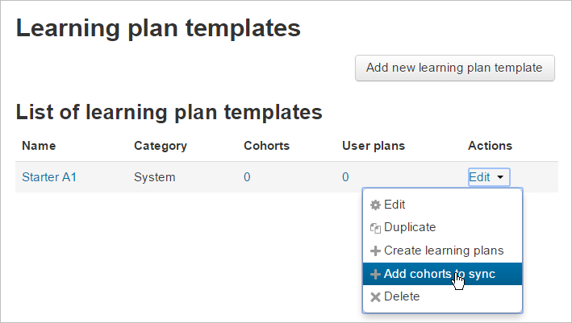
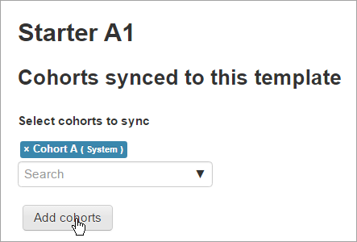
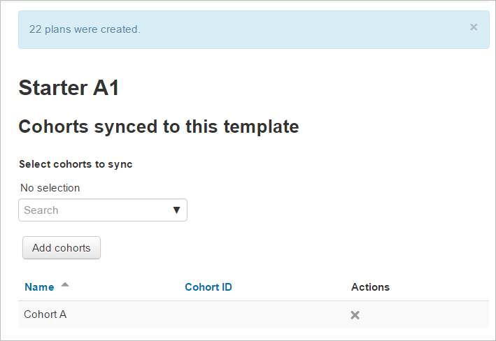
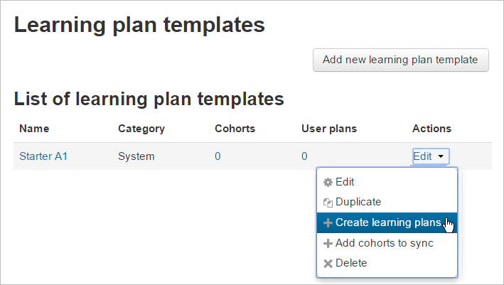
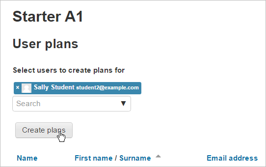
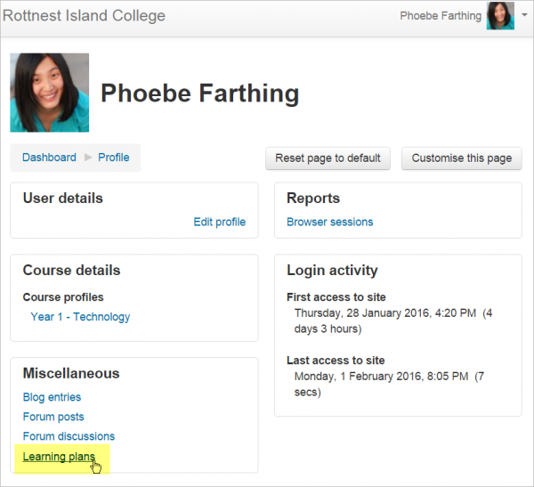
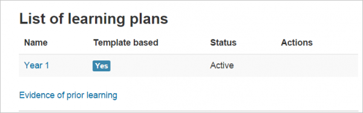
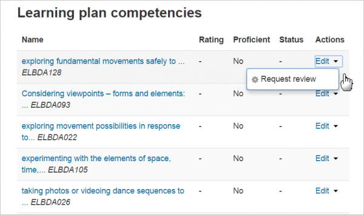
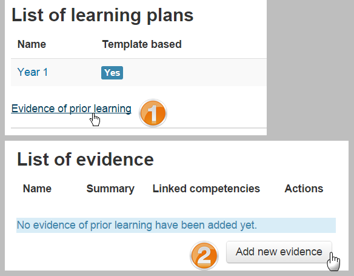

PIANI DI APPRENDIMENTO
=========================

Benvenuto, di seguito potrai consultare i piani di apprendimento che offre il nostro corso:
=======

Una volta impostato un \ |LINK1|\ , è possibile creare un modello di piano di apprendimento. Un modello di piano di apprendimento definisce un insieme di competenze che è possibile assegnare a un gruppo di utenti. Utilizzare questi piani di apprendimento è meglio che crearne di individuali per molti studenti diversi e significa che è sufficiente aggiornare il modello e le modifiche verranno visualizzate per tutti gli studenti.	

    Vai a \ |STYLE0|\  Qui vengono visualizzati tutti i piani 	esistenti e puoi fare clic sul pulsante "Aggiungi nuovo modello di piano di apprendimento" per crearne uno nuovo.

Aggiunta di competenze a un modello di piano di apprendimento

Per aggiungere competenze a un modello, fare clic sul nome del piano di apprendimento (sotto la colonna Nome a sinistra) per andare alla pagina in cui è possibile aggiungere, modificare e rimuovere le competenze. Mostrerà anche quali competenze non sono assegnate a nessun corso.

Una volta aggiunte le competenze al modello, è possibile assegnarlo a singoli studenti oa un'intera coorte di studenti come descritto di seguito.

Assegnazione di piani di apprendimento a coorti	

    Una 	volta che è stato creato un modello di piano di apprendimento, può 	essere assegnato agli studenti individualmente o collettivamente a 	una coorte (prefabbricata).

* Se non ci sei già, vai a Amministrazione sito> Competenze> Modelli piano di apprendimento.

* Sulla 	riga del modello che desideri assegnare, fai clic sull'icona 	"Modifica". Apparirà un menu a tendina che mostra:		

    * modificare	

    * Duplicare		

    * Crea 		

    * piani di apprendimento	

    * Aggiungi 		

    * coorti da sincronizzare	

    * Elimina	

* \ |STYLE1|\  fai clic su "Aggiungi coorti da sincronizzare"

+-----------------------------------------------------------------------------------------------------------------------------------------------------------------------------------------+
|			                                                                                                                                                                                      |
|                                                                                                                                                                                         |
|\ |STYLE2|\  Moodle creerà 	solo 50 piani di apprendimento immediatamente. Se hai una coorte molto grande, un'attività programmata creerà i piani di apprendimento. Vedi \ |LINK2|\  			.|
|                                                                                                                                                                                         |
|		                                                                                                                                                                                       |
+-----------------------------------------------------------------------------------------------------------------------------------------------------------------------------------------+

\ |IMG1|\ 

	

* 	Cerca 	e aggiungi le tue coorti scelte.

\ |IMG2|\ 

    	

* Apparirà un messaggio con il numero di piani di apprendimento creati.

\ |IMG3|\  Assegnazione di piani di apprendimento a un singolo studente

* Per assegnare un piano di apprendimento a un singolo studente, fai clic 	su "Crea piano di apprendimento"

\ |IMG4|\ 	

* Quindi 	cerca e seleziona lo / gli studente / i che desideri realizzare i piani di apprendimento per:

\ |IMG5|\ 

.. _h2065305ec174f28577687851d1148:

Visualizzazione dei piani di apprendimento
==========================================

Chiunque può vedere i propri piani di apprendimento dalla propria pagina del profilo, accessibile dal menu utente:

\ |IMG6|\ 

Quando uno studente fa clic sul link, vede quali piani gli sono stati applicati:

\ |IMG7|\ 

Quando uno studente fa clic sul nome di un piano di apprendimento, vede le competenze associate. Possono vedere i loro progressi verso il completamento e anche fare clic su "Modifica" per richiedere una revisione di qualsiasi competenza:

\ |IMG8|\ 

* Alcuni 	utenti (ad esempio i supervisori) con la \ |LINK3|\  nel contesto dell'utente saranno in grado di vedere i piani di 	apprendimento di altri utenti.	

* Gli utenti con la \ |LINK4|\ hanno 	la possibilità di creare un progetto di piano di apprendimento per 	se stessi. Una bozza di piano di apprendimento può essere inviata 	per l'approvazione per creare un piano di apprendimento attivo dalla bozza. Si noti che questa capacità non è impostata per nessuno dei ruoli predefiniti.	

* Gli utenti con la \ |LINK5|\  possono approvare una bozza di piano di apprendimento.

.. _h761a5a4571385b67371444947361624:

Prova dell'apprendimento precedente
===================================

Chiunque abbia la \ |LINK6|\  grado di fornire un elenco di prove di apprendimento precedente. Questo può essere usato per dimostrare competenza per una o più competenze.

Per caricare prove dell'apprendimento precedente, accedere alla propria pagina dei piani di apprendimento dal proprio profilo e fare clic sul collegamento "Evidenza dell'apprendimento precedente" (1) Nella pagina successiva, fare clic sul pulsante "Aggiungi nuova evidenza" (2) e fornire come molti dettagli sulle prove possibili (inclusi file e url per verificare le prove). Una volta elencata la prova, puoi collegarla a una o più competenze da uno qualsiasi dei tuoi piani di apprendimento. Quindi puoi richiedere che qualcuno riveda la tua competenza per decidere se le prove sono sufficienti e valutare la competenza.

\ |IMG9|\ 

.. bottom of content

.. |STYLE0| replace:: *Amministrazione del sito> Competenze> Modelli del piano 	di apprendimento.*

.. |STYLE1| replace:: **Per assegnare un piano di apprendimento a una coorte,**

.. |STYLE2| replace:: **Nota:**

.. |LINK1| raw:: html

    <a href="https://docs.moodle.org/31/en/Competency_frameworks" target="_blank">framework di competenze</a>

.. |LINK2| raw:: html

    <a href="http://tracker.moodle.org/browse/MDL-52690" target="_blank">MDL-52690</a>

.. |LINK3| raw:: html

    <a href="https://docs.moodle.org/31/en/Capabilities/moodle/competency:planview" target="_blank">possibilità  di visualizzare tutti i piani di apprendimento</a>

.. |LINK4| raw:: html

    <a href="https://docs.moodle.org/31/en/Capabilities/moodle/competency:planviewowndraft" target="_blank">capacità di visualizzare i propri progetti di piani di apprendimento</a>

.. |LINK5| raw:: html

    <a href="https://docs.moodle.org/31/en/Capabilities/moodle/competency:planmanagedraft" target="_blank">capacità di gestire progetti di piani di apprendimento</a>

.. |LINK6| raw:: html

    <a href="https://docs.moodle.org/31/en/Capabilities/moodle/competency:userevidencemanageown" target="_blank">capacità di gestire le proprie prove in</a>

 
 
